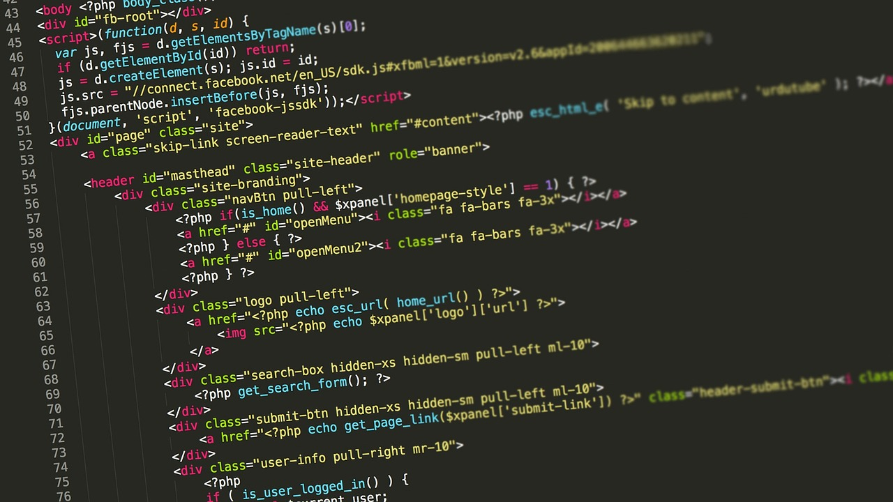

# 📌 Recapitulación de HTML

## 📌 1. Primeros Pasos con HTML

HTML es el lenguaje estándar para crear páginas web. Se compone de etiquetas y elementos estructurados.

### 📍 Ejemplo de una estructura básica:

```html
<!DOCTYPE html>
<html lang="es">
<head>
    <meta charset="UTF-8">
    <meta name="viewport" content="width=device-width, initial-scale=1.0">
    <title>Mi primera página</title>
</head>
<body>
    <h1>Hola, mundo!</h1>
    <p>Bienvenido a HTML.</p>
</body>
</html>
```

- `<!DOCTYPE html>`: Declara el tipo de documento.
- `<html>`: Contenedor principal.
- `<head>`: Metadatos y configuración.
- `<body>`: Contenido visible de la página.

---

## 📌 2. Encabezados en HTML

Los encabezados (`<h1>` a `<h6>`) son importantes para la jerarquía y accesibilidad de la información.

### 📍 Ejemplo:

```html
<h1>Título Principal</h1>
<h2>Subtítulo</h2>
<h3>Encabezado Secundario</h3>
<h4>Encabezado más pequeño</h4>
<h5>Menor importancia</h5>
<h6>El más pequeño</h6>
```

---

## 📌 3. Etiquetas Básicas de Formato de Texto

Algunas etiquetas fundamentales para formatear texto son:

- **Negrita:** `<strong>` o `<b>`
- **Cursiva:** `<em>` o `<i>`
- **Subrayado:** `<u>`
- **Texto tachado:** `<s>` o `<del>`

### 📍 Ejemplo:

```html
<p><strong>Texto en negrita</strong></p>
<p><em>Texto en cursiva</em></p>
<p><u>Texto subrayado</u></p>
<p><s>Texto tachado</s></p>
```

---

## 📌 4. Etiquetas para Enlaces: `<a>`

La etiqueta `<a>` permite crear enlaces a otras páginas o archivos.

### 📍 Ejemplo:

```html
<a href="https://www.google.com" target="_blank">Visitar Google</a>
<a href="datos.xls" download>Descargar archivo Excel</a>
```

- `target="_blank"`: Abre el enlace en una nueva pestaña.
- `download`: Descarga el archivo en lugar de abrirlo.

---

## 📌 5. Imágenes y Archivos Estáticos

La etiqueta `` permite incluir imágenes en la página.

### 📍 Ejemplo:

```html

```
- `src`: Ubicación del archivo.
- `alt`: Descripción alternativa para accesibilidad.
- `width`: Tamaño en píxeles.

También podemos usar `<link>` para añadir hojas de estilo CSS:

```html
<link rel="stylesheet" href="styles.css">
```

---

## 📌 6. Video y Audio en HTML5
### Archivos: `audio.mp3`, `video.mp4`
Podemos integrar contenido multimedia con `<video>` y `<audio>`.

### 📍 Ejemplo de video:

```html
<video width="400" controls>
    <source src="video.mp4" type="video/mp4">
    Tu navegador no soporta el video.
</video>
```

### 📍 Ejemplo de audio:

```html
<audio controls>
    <source src="audio.mp3" type="audio/mp3">
    Tu navegador no soporta el audio.
</audio>
```

- `controls`: Agrega controles de reproducción.
- `source`: Permite múltiples formatos para compatibilidad.

---

## 📌 7. Saltos de Línea y Espaciado con `<br>` y `<hr>`
El `<br>` se usa para forzar un salto de línea.  
El `<hr>` crea una línea horizontal para separar contenido.

### 📍 Ejemplo:

```html
<p>Este es un texto con <br> un salto de línea.</p>
<hr>
<p>Después de esta línea hay una separación.</p>
```

---


Este repaso cubre los fundamentos de HTML, incluyendo estructura básica, encabezados, enlaces, imágenes, multimedia y formateo de texto.