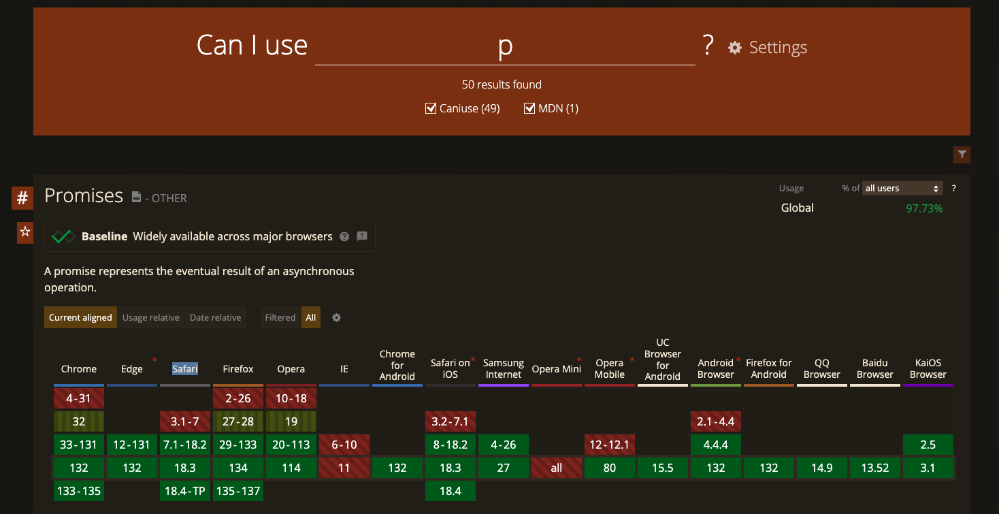

# learn-html

Repositorio para aprender HTML. 

Para contribuir crea un fork, más información: [cómo contribuir](./CONTRIBUTING.md).

## HTML

- Teoría con ejemplos: [HTMl en W3schools](https://www.w3schools.com/html/default.asp)
  - ✅ Resume la teoría y separa por temas el contenido
  - ❌ No está traducida oficialmente => se puede traducir con Translator (click derecho > traducir)

- Documentación "oficial" en MDN (bastante actualizado): [HTML, CSS, JS en MDN](https://developer.mozilla.org/es/)
  - ✅ Documentación fiable y actualizada
  - ✅ Bastante traducido al español
  - ❌ Temas más extensos => es similar a la docs oficial

- Documentación oficial (esta vez sí): https://html.spec.whatwg.org/multipage/
  - ✅ Fuente de verdad
  - ❌ No está traducida y es muy extensa y faltan ejemplo simples en algunos casos

### Compatibilidad

- Verificar si se puede usar una etiqueta: https://caniuse.com/
  - Se puede ver la disponibilidad entre navegadores para etiquetas, atributos, etc.

  

### Cursos en vídeo

- [FreeCodeCamp en Español: HTML y CSS](https://www.youtube.com/watch?v=XqFR2lqBYPs&ab_channel=freeCodeCampEspa%C3%B1ol)
- [FreeCodeCamp en inglés: HTML](https://www.youtube.com/watch?v=kUMe1FH4CHE&list=PLWKjhJtqVAbnSe1qUNMG7AbPmjIG54u88&ab_channel=freeCodeCamp.org)

### Certificados

- [Responsive Web Design](https://www.freecodecamp.org/learn/2022/responsive-web-design/)
- [Javascript: algoritmos y estructuras de datos](https://www.freecodecamp.org/learn/javascript-algorithms-and-data-structures-v8/)
- [Librerías de Front-end (React, Bootstrap, etc.)](https://www.freecodecamp.org/learn/front-end-development-libraries/)

## CSS 

Hoja de estilos de `Water.css` (estilos headless):
- [https://watercss.kognise.dev/](https://watercss.kognise.dev/)

Se coloca en el <head>:

```html
  <link rel="stylesheet" href="https://cdn.jsdelivr.net/npm/water.css@2/out/water.css">
```

## Recursos

- [Aplicación para aprender tecnologías](https://mimo.org/)
- [Academia de Cisco](https://www.netacad.com/es/programming)


## Ejercicios

1. https://www.auladiv.com/ejercicios/html-basico/